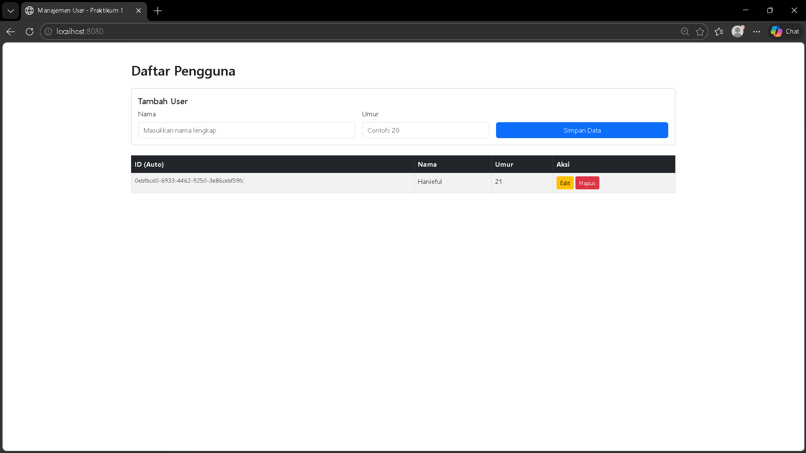

1. Tambah User (Create)
   Ini adalah apa yang terlihat pada screenshot kamu. Kamu mengirim data ke server, dan server menyimpannya.

Method & Endpoint: POST http://localhost:8080/api/users

Request Body (JSON):

JSON
{
"name": "Hanieful",
"age": "21"
}
Response Status: 201 Created (Artinya: Data baru berhasil dibuat dan disimpan).

Response Body: Mengembalikan objek yang baru dibuat, lengkap dengan UUID yang dihasilkan sistem secara otomatis.

2. Ambil Semua User (Read All)
   Endpoint ini digunakan untuk mengisi tabel "Daftar Pengguna" pada tampilan website.

Method & Endpoint: GET http://localhost:8080/api/users

Fungsi: Menarik seluruh daftar user yang ada di database.

Response Status: 200 OK

Response Data: Berupa Array (ditandai dengan kurung siku []) yang berisi banyak objek user.

3. Ambil User Berdasarkan ID (Read Single)
   Digunakan jika kamu ingin melihat detail satu orang saja tanpa memuat semua data.

Method & Endpoint: GET http://localhost:8080/api/users/{id}

Contoh: GET /api/users/0ebfbcd0-6933-4462-9250-3e86cebf59fc

Response Status: 200 OK

4. Update User (Update)
   Biasanya dipicu saat tombol "Edit" pada website diklik, kemudian user menekan "Simpan".

Method & Endpoint: PUT http://localhost:8080/api/users/{id}

Fungsi: Mengubah data (seperti mengganti nama atau umur) pada ID tertentu.

Response Status: 200 OK

5. Hapus User (Delete)
   Dipicu saat tombol "Hapus" berwarna merah diklik di website.

Method & Endpoint: DELETE http://localhost:8080/api/users/{id}

Fungsi: Menghapus data secara permanen dari database.

Response Status: 200 OK